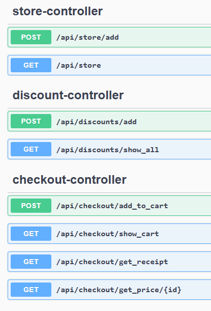

# Store

## Overview

**Store** is a example project in which I have implemented simple REST API simulating market checkout component. 


## Technologies

- Backend - Java 23, SpringBoot 3.4.0
- Tools - SwaggerUI, Gradle, Postman
- Development Enviroment - IntelliJ IDEA, Visual Studio Code

## Setup

Clone repository

```
git clone https://github.com/krudny/Store.git
```

Enter project directory

```
cd Store/store
```

Start application 

```
gradlew run
```

`Note:` It is highly recommended to use `Postman` or other API testing tool to make requests. 

## SwaggerUI

All Api endpoints are documented in SwaggerUI. To access it, go to `http://localhost:8080/swagger-ui.html` in your browser.



## Configurator

In order to make the application more flexible, I have implemented a simple configurator which adds few items and discounts to project every time it starts. 
You can find it in `configurator` package. It was not mentioned in requirements to use database, but it would be a good idea to store items and discounts in database and load them from there. 

## Sample usage

### Check possible items
   
`GET http://localhost:8080/api/store`

### Add items to cart

`POST localhost:8080/api/checkout/add_to_cart`

```json
{
    "itemId": 1,
    "quantity": 2
}

{
    "itemId": 2,
    "quantity": 5
}

{
    "itemId": 3,
    "quantity": 10
}
```

### Generate receipt
   
`GET http://localhost:8080/api/checkout/get_receipt`

### Sample output
```
Truck x 2 = 30.0PLN 
Toy x 10 = 100.0PLN 
Teddy x 5 = 22.5PLN 
Discount from pair items: 0.0PLN 
Total price: 152.5PLN
```

`Note`: It is possible to add more products and discounts using endpoints documented in `SwaggerUI`.
   